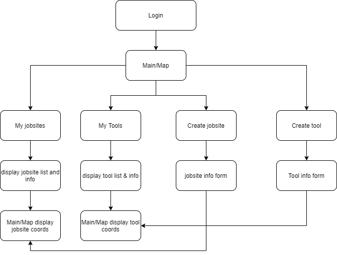

# Tool Tracker


<p align="center">
 
</p>

---

## Table of Contents

- [Project Concept](#project-concept)
- [User Story](#user-story)
- [Application MVP](#application-mvp)
- [Design](#design)
- [Technologies Used for Development](#technologies-used-for-development)
- [Team Members](#team-members)

<br>

---


## Project Concept

A lightweight webapp for tracking valuable tools across multiple jobsites.

- Plot areas on a map to represent jobsites.

- Create and track tools and information across multiple jobsites.

- Browse tools associated with jobsites.

- Interactive map.

<br>

_Return to [Table of Contents](#table-of-contents)_

---

## User Story

```
AS a user who needs to keep track of multiple tools

I WANT to be able to use an online application

SO THAT I can know the locations of all jobsites and tools within

```

<br>

_Return to [Table of Contents](#table-of-contents)_

---

## Application MVP

- The User can _register_, _login_ and _logout_.

- The User can create multiple jobsites by drawing an area on the interactive map.

- The User can create multiple tools with various fields of information, associated with a specific jobsite.

- The User can find their current location on the map.

- The User can delete, add, or transfer a tool in a specific jobite.

- The user can quickly find tools by using a search bar

- The user can select a specific jobsite to see a list of tools, as well as information about the jobsite

<br>

_Return to [Table of Contents](#table-of-contents)_

---

## Design

### Actions Diagram

The flow chart below outlines the basic functionality of the app.

<details>
  <summary> Click to expand the functionality flow chart.</summary>



</details>

<br>

### ER Diagram (coming soon)

<details>
<summary> Click to expand the ER diagram.</summary>

</details>

<br>

### Wireframes


<details>
<summary> Click to expand wireframe designs.</summary>

  

</details>

<br>


_Return to [Table of Contents](#table-of-contents)_

---

## Technologies Used for Development


Here is a list of core technologies that were used to develop this web application.

| Technologies   | Description                                                                                              |
| ------------   | -------------------------------------------------------------------------------------------------------- |
| MUI            | React UI component library used to for front end design                                                  |
| React.js       | Javascript library used to design the front-end of this application                                      |
| react-mapbox-gl| Package that provides react API for Mapbox                                                               |
| Database       | TBD                                                                                                      |
| Next.js        | React framework for production                                                                           |
| Mapbox API     | Location data                                                                                            |

---

<br>

## Team Members

- [SalahAmer2](https://github.com/SalahAmer2)
- [Joshua Martinez](https://github.com/JDMartinez1531)

<br>

_Return to [Table of Contents](#table-of-contents)_